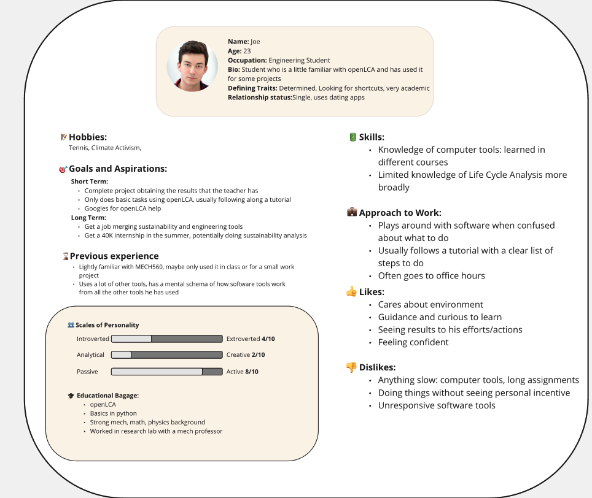
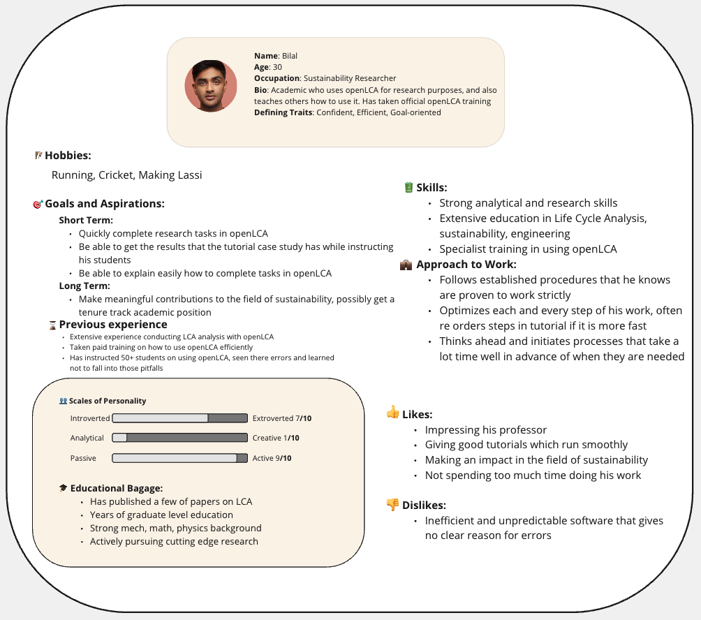
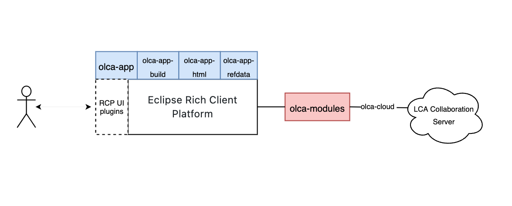
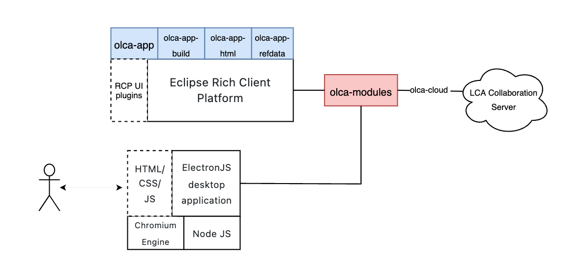

# Table of Contents
1. [Overview ✏️](#overview)
2. [Observing Users 👥](#users)
3. [The Problem 📛](#problem)
4. [Personas 👱‍♂️](#personas)
5. [Use Case Scenario](#usecase)
6. [Related Products](#products)
7. [Comparing The Products](#comparing)
8. [Designing at a High Level](#high)
9. [Justifying Feasibility](#just)

# Overview ✏️ 
The world is waking up to the fact that climate change is a grave threat. Industry, academia and society is realizing that we need to assess the environmental impact of everything that we do. A big part of this is doing a complete assessment of the environmental impact associated with all of the stages of the life cycle of a product. In the field, this is known as life-cycle assessment.

Researchers and engineers need to use a LCA software. The most popular free open source option available right now is openLCA. While it is a powerful platform, it can be very unintuitive to use. The menus are bloated, it is riddled with strange user interfaces glitches. To almost all new users and a good portion of expert users, the software is as confusing as it is powerful. 

Our projects aimed to build a new user interface for openLCA that will allow users to do the most common tasks that openLCA is used for with minimal friction. 

# Observing Users 👥 

For the initial stage we observed 3 users completing the same case study. The case study was vocally led by a facilitator. The facilitator followed the tutorial in a sequential manner, leaving the very little description of the required actions. The participants obtained additional support either from selected parts of the tutorial or selected videos only once the facilitators had decided the participant would not be able to pursue the step.

## Participants 
### Beginner (Subject 1)
- Is currently a STEM student and has used openLCA for some analysis group projects.
- Is currently a STEM student and has used openLCA for some analysis group projects.

### Expert (Subject 2)
* More advanced PHD student who uses openLCA regularly
* Followed trainings by GreenDelta
* Has taught OpenLCA tutorials, witnessing many mistakes

### Novice (Subject 3)
* No Experience with openLCI
* Potential future user: a graduate student in Sustainability and GIS
* Strong background with open source GIS tools

#### Documents/Material for each User Observation:
TODO

# Identifying the problem 📛
The main problem of the world's most popular free LCA software is how unintuitive it is. There are many UI related issues and is prone to many pitfalls, even by experts, which result in the inaccuraccy of the LC Analysis. 

A typical LCA has these main steps:
* Importing a Database
* Creating and configuring flows
* Creating and configuring processes
* Creating and configuring product Systems
* Setting up a project and obtaining the final LCA report

All of these stages has multiple UI issues, which were collected during our user observations. We also brainstormed solutions to each of these issues. 

These issues can be seen [in the document linked here](./problems.pdf)

### TODO: Document listing all the issues
#### Other documents/screenshots/files

# Personas 👱‍♂️ 

### TODOS: Task based segmentation
### Subject 1 - Joe

### Subject 2 - Bilal

# Use Case Scenario 💡

### Scenario Illustration

# Related Products
# Comparing the Products
# Designing at a High Level

### Design of current openLCA tech stack
OpenLCA is a JAVA-based open-source application that is built on the Eclipse Rich Client Platform. The RCP platform provides the necessary tool kits and widgets for it to be a functional desktop-based application. The openLCA application consists of 4 key sub-projects.
olca-app: contains the source code of the openLCA RCP application.
olca-app-build: contains the build scripts for compiling openLCA and creating the installers for Windows, Linux, and macOS.
olca-app-html: contains the source code for the HTML views in openLCA (like the start page or the report views).
olca-refdata: contains the current reference data (units, quantities, and flows) that are packaged with openLCA.
The application depends on the olca-modules, which provide the main functionalities and the core APIs, as a maven project.
LCA Collaboration Server contains the remote data repositories for the application to use.

### Design of Proposed Solution
Our proposed system will potentially create a new thin UI layer over the existing openLCA application, in hopes of improving the interaction and UX. Technologies such as NodeJS, HTML, CSS and JS will be required to build the front-end UI. A popular framework ReactJS can be used to create the UIs and interactive buttons, and using ElectronJS and NodeJS, it will communicate with the existing eclipse RCP application. The integration to the core openlca-modules and database manipulation will allow for the changes to be reflected back to the front-end

# Justifying Feasibility

The feasibility of our project will hinge upon our ability to achieve two main goals.

**GOAL 1:** Build a functional front end interface, functional on Windows, Mac and Linux

**GOAL 2:** Integrate this front end to the openLCA backend, process results and return useful results.

Our team has ample expertise and time to achieve both of these objectives during the course of the semester. 

The time required for these two goals will be roughly 55 hours for the front end and 35 hours for the integration. The integration is expected to take a lot of time due to the fact that it is with an unknown codebase. Most of this development time will be at the start of the semester. 

Once done with integration, we expect our front end construction to be lightning fast due to our previous experience building front ends.

### Justification for GOAL 1

Writing 3 native applications for Windows, Mac and Linux separately would be impossible. Thus we are using Electron.js, which allows us to build cross-platform desktop applications using React.js, Javascript, HTML and CSS. 

This will also allow us to leverage our past web development experience to build a desktop front end. All three team members have experience working in industry (Autodesk, Publicis Sapient, Citibank, Intact, Airliquide, Osmose) to deliver software using the above mentioned tools under strict deadlines and similar timeframes ( ~ 3 months). 

Furthermore, since we are intentionally simplifying the openLCA UI and only programming a subset of important features, our front end work load will be cut down even further. 

Put simply, we are confident we will be able to develop a functional front end because we have done it before many times.

### Justification for GOAL 2 

This is the harder goal, but we believe it is manageable. 

The OpenLCA backend has a massive codebase, and understanding all of it over the semester is impossible. Which is why we will only restrict our attention to figuring out only how to insert our data and get our results using the pre existing functions. In order to use this, we will utilise three main resources

**3. Example code:** Each folder in the codebase has a tests and examples folder which illustrate how to use the functions written in the codebase to do certain tasks (example). These illustrate in isolation how to use openLCA functions to import a database, create a flow etc.

**2. How the code is used in the existing openLCA frontend:** The existing openLCA front already uses the openLCA backend module to implement the functionality we plan to implement. Thus, if we are ever confused about how to use a function, we can use this code to clarify users

**1. Contact with openLCA developers:** We have contacted the lead developers who wrote the majority of the openLCA backend. They have agreed to answer any technical questions we might have. 

Given these resources, as well as the team's previous experience with JAVA in both professional and academic contexts, we are confident we will be able to integrate our frontend into the openLCA backend.

