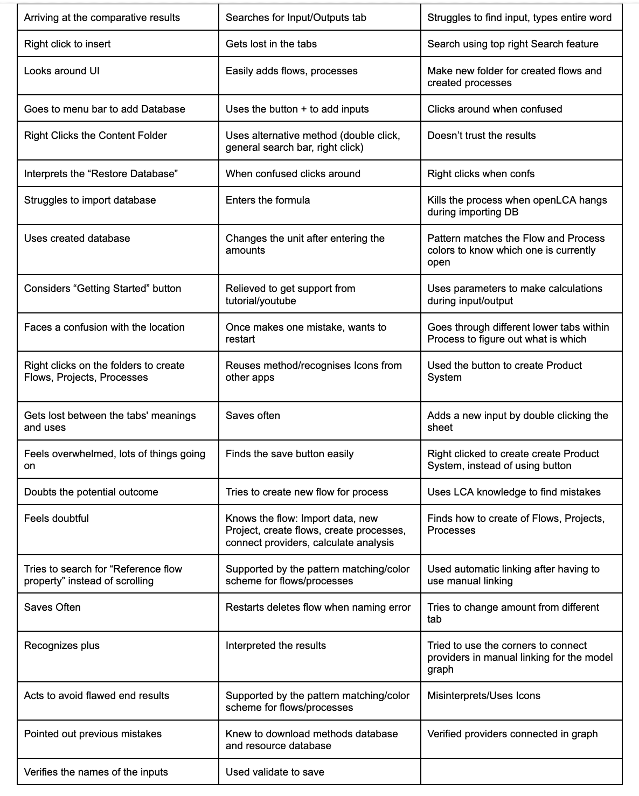
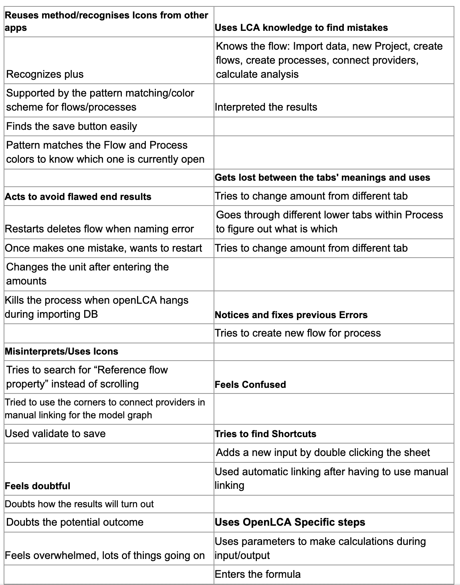
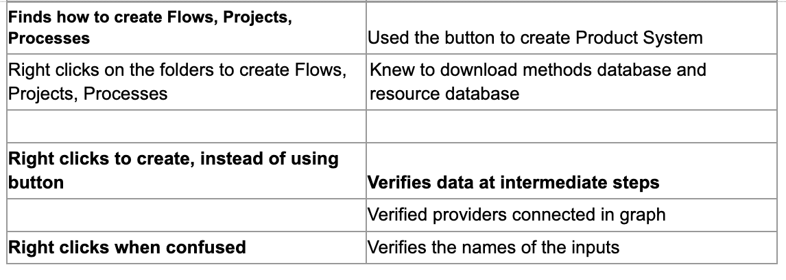
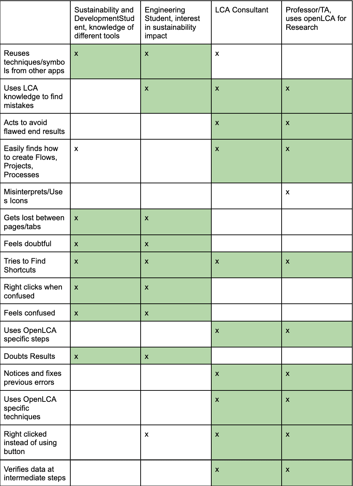
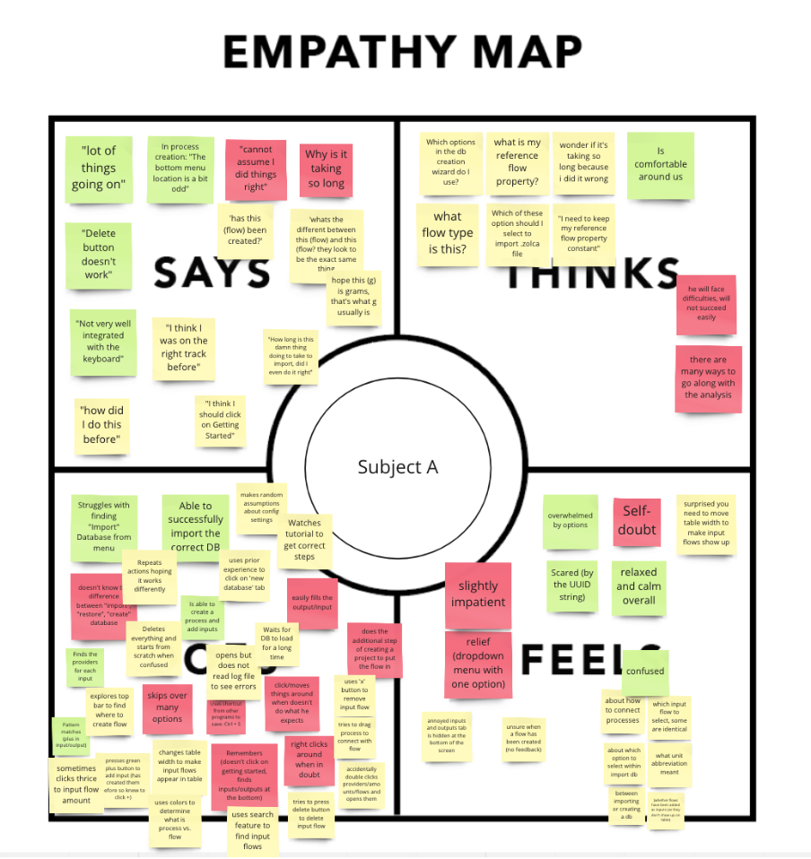
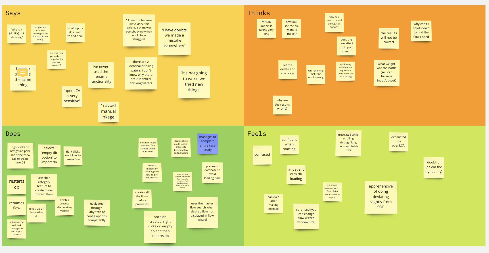
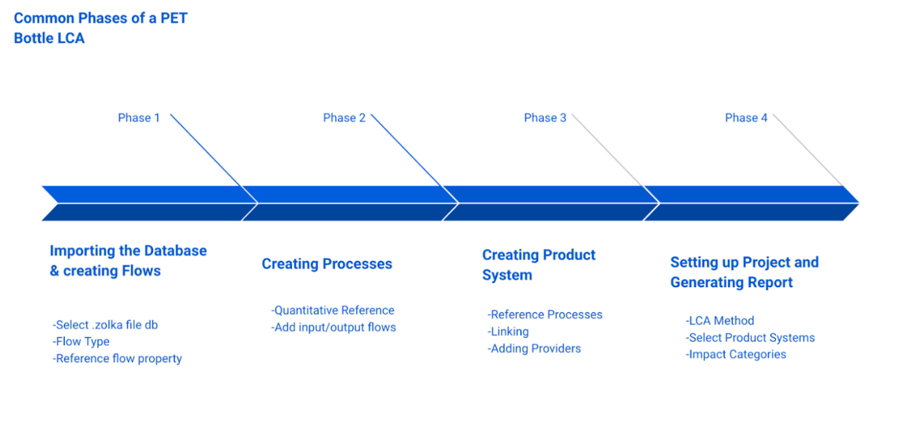
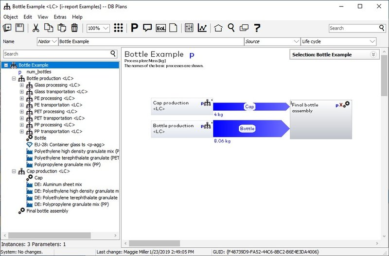
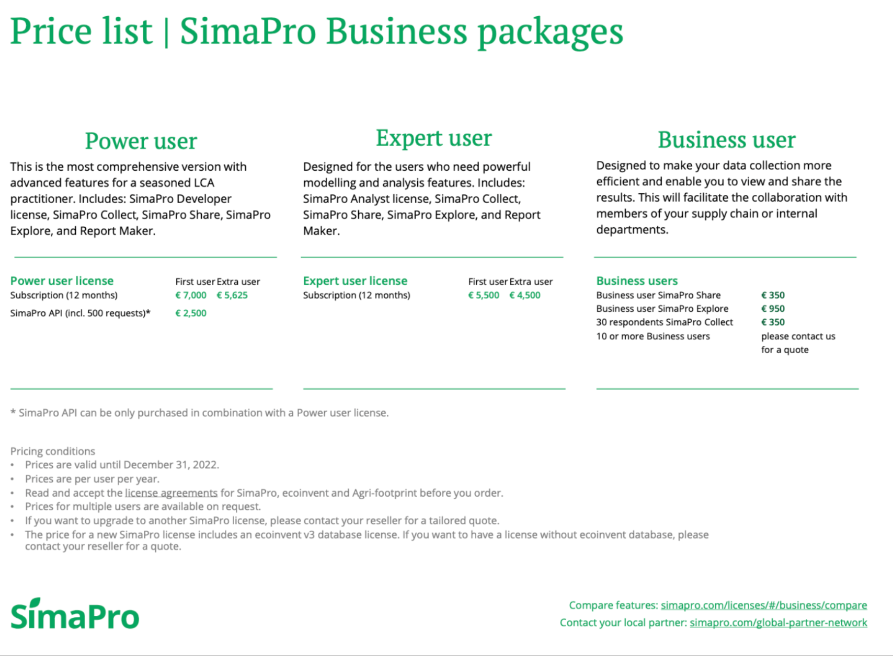
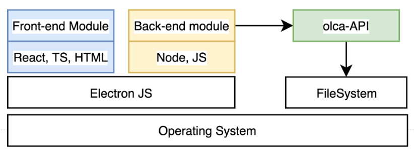

# Table of Contents
1. [Overview ✏️](#overview)
2. [Observing Users 👥](#users)
3. [The Problem 📛](#problem)
4. [Personas 👱‍♂️](#personas)
5. [Use Case Scenario](#usecase)
6. [Related Products](#products)
7. [Comparing The Products](#comparing)
8. [Designing at a High Level](#high)
9. [Justifying Feasibility](#just)

# Overview ✏️ 
The world is waking up to the fact that climate change is a grave threat. Industry, academia and society is realizing that we need to assess the environmental impact of everything that we do. A big part of this is doing a complete assessment of the environmental impact associated with all of the stages of the life cycle of a product. In the field, this is known as life-cycle assessment.

Researchers and engineers need to use a LCA software. The most popular free open source option available right now is openLCA. While it is a powerful platform, it can be very unintuitive to use. The menus are bloated, it is riddled with strange user interfaces glitches. To almost all new users and a good portion of expert users, the software is as confusing as it is powerful. 

Our projects aimed to build a new user interface for openLCA that will allow users to do the most common tasks that openLCA is used for with minimal friction. 

# Observing Users 👥 

For the initial stage we observed 3 users completing the same case study of the life cycle analysis of a PET Bottle Cap and a PC Bottle cap. The case study was vocally led by a facilitator. The facilitator gave instructions to the users on what they were supposed to achieve (‘add a flow’), but did not specify how to use openLCA to do these tasks. The participants were allowed to interact with the software as they wished. The participants obtained additional support either from selected parts of the tutorial or selected videos only once the facilitators had decided the participant would not be able to complete a given task.

## Participants
### Beginner (Subject 1)
- Is currently a STEM student and has used openLCA for some analysis group projects.
- Is currently a STEM student and has used openLCA for some analysis group projects.

### Expert (Subject 2)
* More advanced PHD student who uses openLCA regularly
* Followed trainings by GreenDelta
* Has taught OpenLCA tutorials, witnessing many mistakes

### Novice (Subject 3)
* No Experience with openLCI
* Potential future user: a graduate student in Sustainability and GIS
* Strong background with open source GIS tools

##### Documents/Material for each User Observation:
* [Subject 1 Notes](./docs/s1notes.pdf)
* [Subject 2 Notes](./docs/s2notes.pdf)
* [Subject 2 Snippets/Screenshots](./docs/s2problems.pdf)
* [Subject 3 Notes](./docs/s3notes.pdf)

# Identifying the problem 📛 
The main problem of the world's most popular free LCA software is how unintuitive it is. There are many UI related issues and is prone to many pitfalls, even by experts, which result in the inaccuraccy of the LC Analysis. 

A typical LCA has these main steps:
* Importing a Database
* Creating and configuring flows
* Creating and configuring processes
* Creating and configuring product Systems
* Setting up a project and obtaining the final LCA report

All of these stages has multiple UI issues, which were collected during our user observations. We also brainstormed solutions to each of these issues. 

These issues and user interaction flows can be seen [in the document linked here](./docs/problems.pdf)

# Personas 👱‍♂️ 

### Subject 1 - Joe

### Subject 2 - Bilal

## Task Based Segmentation
Following Indi Youngs format for building personas and user groups we followed the three steps: listing distinguishing behaviors, grouping tasks and naming the groups, from which we built the two personas: Joe and Bilal.

### Listing Distinguishing Behaviors
From our user observations, we developed the list of distinguishing behaviors presented in Table 1, which was divided into groups presented in Table 2.
**Table 1. List Distinguishing Behaviors**

**Table 2. Grouping Distinguishing Tasks**

From the behavioral affinity groups, we had found and the grouped tasks we built table 3, from which we clearly discerned 2 trends. The student and future user, whose knowledge of openLCA is quite limited and the professor and consultant, who seemingly have a lot more confidence and a greater awareness of the pitfalls of the tool.

**Table 3. Crossing with designed personalities**

In parallel we developed empathy maps to set additional foundations to persona developments. The empathy map for one of our 2 discerned personas is linked below:

Following these steps we developed the 2 personas presented above.

# Use Case Scenario 💡 

The following story describes a use case for Joe, who would like to conduct a Life Cycle Analysis for one of his group projects. 

Joe would like to create an LCA report for PET Water Bottles using the Ecoinvent 3.2 database. Joe has another assignment and would like to finish this analysis as soon as possible.

Joe opens the redesigned LCA desktop application on his computer. Joe simply drags the database file he would like to import into fastLCA. He could also have right-clicked and imported a new database through the file system. 

Joe is usually confused about what he needs to do. But the UI indicates that there are only four actions he can take; create a flow, create a process, create a product system and create a project. 

Reading his tutorial, he knows he needs to create a flow. He simply presses a “New Flow” button, selects the type of flow (each type’s description is available by hovering over it), and creates it. The System displays a “kog” if he would like to configure optional flow properties, but he doesn’t want to and moves on to creating two other flows.

Once Joe is done creating his flows, he wants to create his process. He clicks the ‘Create Process’. This is where Joe assigns the input and output flow to the process, their units, amounts, and providers. If Joe makes a mistake and the input amount doesn’t match the output amount, the system alerts him immediately and requests him to fix it. 

While creating his process, Joe decides to change his flow’s name, and the system automatically propagates this changed name throughout the software.

Joe then clicks ‘Create Product System’. He selects Process C as his reference process. Once this product system is created, he presses ‘Link’ to automatically link all his processes. He is not provided with a manual linking option. 

Once finished, Joe clicks ‘Create Project’. He adds the newly created product system to this project, as well as 2 previously created product systems. Once done, Joe selects an LCIA method from a searchable dropdown, as well as the impact factors he wants to assess. He then clicks the ‘Generate Report’ button to create the LCA report.

# Related Products 
### Complete Desktop Tools 
| Paying | Tool | Software Type | Link |
| -- | --------- | --------- | ------- |
| |  
| X | SimaPro - PRé | Various tools | https://pre-sustainability.com/solutions/tools/simapro |
| X | GaBi - Sphera | Various tools | https://gabi.sphera.com/canada/software/gabi-software/gabi-circularity-toolkit/
X | Umberto, IFU Hamburg | Downloadable software |https://www.ifu.com/umberto/lca-software/
X | ATHENA - Athena Institute | Downloadable | Focused on Buildings, Pavement, Residential Assemblies, Roadways, Commercial Assemblies limited: “The results presented are the same as, and derived from the parent software, the Impact Estimator. However, the user is limited to the existing pre-defined assemblies." http://www.athenasmi.org/our-software-data/overview/
X | BEES - FIrst Environment | Web App | Focused toward Building products https://www.nist.gov/services-resources/software/bees

### Lighter Tools 
| Paying | Tool | Software Type | Link |
| -- | --------- | --------- | ------- |
| | Ecolizer.be | Web Interface | https://ecodesign.vlaanderen-circulair.be/en
| X | SustainableMinds |  |  http://www.sustainableminds.com/
| |EIOLCA - Carnegie Mellon | Web | For non-commercial http://www.eiolca.net/

These tables are built from the most broadly used tools. There are additional tools, but due to their limited visibility we chose to not look too deeply.

We chose to focus our product analysis of SimaPro - Pré and GaBi - Sphera as they are the most broadly accepted tools. Both tools offer, unlike openLCA, different versions of the software. openLCA being a downloadable software we chose to focus our analysis on their downloadable products. Both require a paying license for their downloadable software. In addition, both products are full-service LCA tools, meaning they provide the data as well as an LCA analysis tools.

## GaBi - Sphera 
This tool seems to be renowned for its wide and adaptive database, which integrates and to the most commonly used databases such as ELCD and ecoinvent. There is also the option to request additional datasets. However GaBi faces the similar issue of openLCA of having a complex user interface 

 However GaBi faces the similar issue of openLCA of having a complex user interface. (“Patience is required when exploring the program” - [Review of LCA Tools, Hollerand, et al.](https://dovetailinc.org/upload/tmp/1579558516.pdf).

## SimaPro -  Pré:
After our research this is the product that seemed to be the biggest competitor. It has developed extensive add-on library, from our readings seems to have a strong focus on usability and interpretability ([Hollerand, et al.](https://dovetailinc.org/upload/tmp/1579558516.pdf), [Ecochain LCA software comparison](https://ecochain.com/knowledge/life-cycle-assessment-software-overview-comparison/)) all the while conserving the complexity of LCA calculations. 

This tool however seems to be much less versatile when it comes to database compatibility. Full-service tools would require an extensive database to be comparable with openLCA’s compatibility. Finally, this tool (like most on the market) is paying and SimaPro - PRé’s demo is very limited. This means that in order to learn to use the interface, users must thus pay initially. This can be limiting and puts it a step behind a more user friendly interfaced openLCA.
<figure>
  
  <figcaption>SimaPro Pricing Options</figcaption>
</figure>

# Comparing the  Products 
## Supported by openLCA
The primary argument for the use of openLCA over other LCA is the combination of being open source and having a very complete toolkit. In the group of complete tools it is the only one to be free. As shown by the table above, only very light, web interface tools or specialized tools are free. We chose openLCA additionally for its very large user base, incentivized by its compatibility with many datasets. It is currently compatible with any Nexus databases: https://nexus.openlca.org/databases. The database defines the precision of the models and analysis, so it seemed fundamental to us to develop the most precise tool. The previous tools GaBi - Sphera and SimaPro - Pré are only compatible with their respective databases. Although GaBi does integrate Eco-invent (the most widely used government database), openLCA’s larger compatibility enables a larger flexibility for users. This large user base manifests itself through askOpenLCA.com, a platform for user/developer communication and support. This additionally showed us the developer’s willingness to support their tool and it’s accessibility, which we additionally witnessed in our exchanges with them since the start of the project.

*“openLCA is the cheapest solution in our list – because it’s free. OpenLCA is an open-source LCA solution, which means that it is attractive for anyone starting off in the LCA world without a big budget. However, openLCA also has extensive deep-dive functionality, which also makes it useful for users with a more technical background. openLCA Website”*
 \- [Ecochain LCA Software Comparison](https://ecochain.com/knowledge/life-cycle-assessment-software-overview-comparison/)

## Benefits of our tool
Not only is openLCA an ideal support for LCA analysis but it is the foundation for our product to be more adapted to research and academic implementation. From our discussion with Sub. 2 and our research, openLCA’s biggest pitfall is its lack of focus on usability. The main issue that causes it to lose users to competitors is its instability in the face of human-caused error. Although the methods are deterministic, the user interface leaves a lot of room for mistakes for the user to make, causing faulty results. With the more usable design we have proposed, openLCA would be free, complete, versatile, usable and help the user avoid the current pitfalls.

**Additional Source:** [LCA Lecture](https://www.youtube.com/watch?v=uXj3M9Z4B4g&ab_channel=JeremyFaludi)

# Designing at a High Level 

### Design of current openLCA tech stack
OpenLCA is a JAVA-based open-source application that is built on the Eclipse Rich Client Platform. The RCP platform provides the necessary tool kits and widgets for it to be a functional desktop-based application. The openLCA application consists of 4 key sub-projects.
olca-app: contains the source code of the openLCA RCP application.
olca-app-build: contains the build scripts for compiling openLCA and creating the installers for Windows, Linux, and macOS.
olca-app-html: contains the source code for the HTML views in openLCA (like the start page or the report views).
olca-refdata: contains the current reference data (units, quantities, and flows) that are packaged with openLCA.
The application depends on the olca-modules, which provide the main functionalities and the core APIs, as a maven project.
LCA Collaboration Server contains the remote data repositories for the application to use.

### Design of Proposed Solution

OpenLCA is a powerful tool for LCA analysis. Most of the issues found are related to the UI flow of the RCP platform. Our proposed system will create a new thin UI layer over the existing openLCA application, in hopes of improving the interaction and UX.
Tools and Framework required: NodeJS, ElectronJS, ReactJS, Eclipse RCP IDE, JAVA, Maven
Olca-modules contain the core logic and API for the openLCA application. The goal is to create a cross-platform application using ElectronJS, and then using NodeJS runtime, connect it to the API. Using this, we will be able to achieve the same functionality as it is in the Eclipse RCP application. 

The repository: https://github.com/GreenDelta/olca-modules contains the source code for olca-modules
Some of the core functionalities we will be focusing on are:
* Importing Database API
* Flows API: Creating Flows, Searching through flows
* Process APIs
* Product System APIs
* Project Setup Apis (Generating Report PDF)

# Justifying Feasibility 

The feasibility of our project will hinge upon our ability to achieve two main goals.

**GOAL 1:** Build a functional front end interface, functional on Windows, Mac and Linux

**GOAL 2:** Integrate this front end to the openLCA backend, process results and return useful results.

Our team has ample expertise and time to achieve both of these objectives during the course of the semester. 

The time required for these two goals will be roughly 55 hours for the front end and 35 hours for the integration. The integration is expected to take a lot of time due to the fact that it is with an unknown codebase. Most of this development time will be at the start of the semester. 

Once done with integration, we expect our front end construction to be lightning fast due to our previous experience building front ends.

### Justification for GOAL 1

Writing 3 native applications for Windows, Mac and Linux separately would be impossible. Thus we are using Electron.js, which allows us to build cross-platform desktop applications using React.js, Javascript, HTML and CSS. 

This will also allow us to leverage our past web development experience to build a desktop front end. All three team members have experience working in industry (Autodesk, Publicis Sapient, Citibank, Intact, Airliquide, Osmose) to deliver software using the above mentioned tools under strict deadlines and similar timeframes ( ~ 3 months). 

Furthermore, since we are intentionally simplifying the openLCA UI and only programming a subset of important features, our front end work load will be cut down even further. 

Put simply, we are confident we will be able to develop a functional front end because we have done it before many times.

### Justification for GOAL 2 

This is the harder goal, but we believe it is manageable. 

The OpenLCA backend has a massive codebase, and understanding all of it over the semester is impossible. Which is why we will only restrict our attention to figuring out only how to insert our data and get our results using the pre existing functions. In order to use this, we will utilise three main resources

**3. Example code:** Each folder in the codebase has a tests and examples folder which illustrate how to use the functions written in the codebase to do certain tasks (example). These illustrate in isolation how to use openLCA functions to import a database, create a flow etc.

**2. How the code is used in the existing openLCA frontend:** The existing openLCA front already uses the openLCA backend module to implement the functionality we plan to implement. Thus, if we are ever confused about how to use a function, we can use this code to clarify users

**1. Contact with openLCA developers:** We have contacted the lead developers who wrote the majority of the openLCA backend. They have agreed to answer any technical questions we might have. 

Given these resources, as well as the team's previous experience with JAVA in both professional and academic contexts, we are confident we will be able to integrate our frontend into the openLCA backend.

